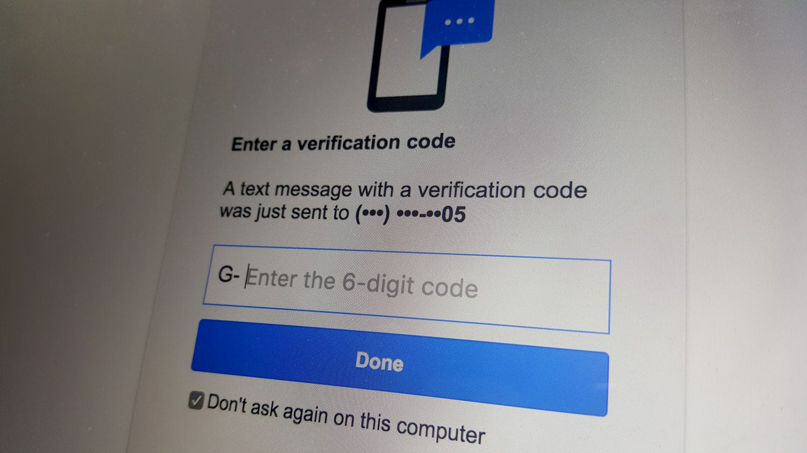
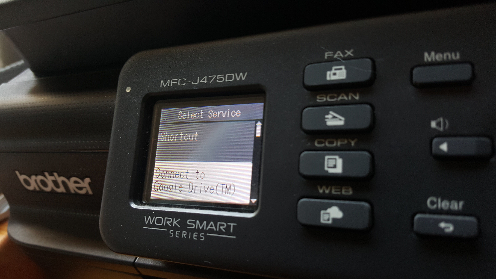
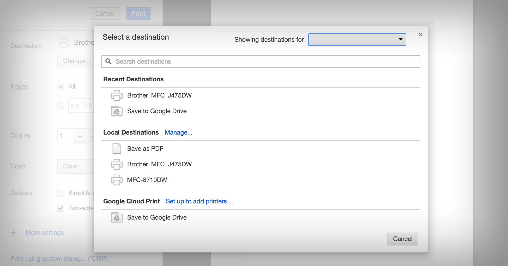
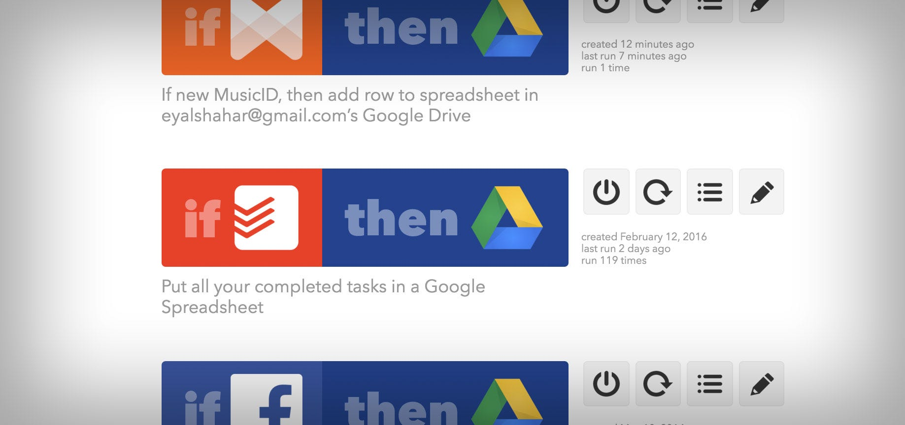

**I keep my life on Google. It’s probably a bad idea to announce it publicly, aiming the spotlight for hackers, but it’s well known that no company handles data as good as Google, so why not make use of that?**

So here are a couple of tips on how I use Google Drive:

## 1. Security — Two Step Verification

I wasn’t kidding. I have lots of personal documents stored in Drive and I fear the day someone will hack into my account. So I set up a two-step authentication on my account.It’s fairly simple: Go to [this page](https://www.google.com/landing/2step/), sign in, and verify your phone number. Once you’re done setting it up, every time you log in to your account from a new device, you will get a text message with a 6 digit code that you’ll need to type in. So even if someone finds your Google password — they will still be locked out without your phone. I highly recommend setting it up on every service you put your trust in. Facebook, Twitter, Evernote, and many more offer this option.

## 2. Scan to Drive

3 years ago I bought an [$80 printer-scanner](http://www.amazon.com/Brother-Printer-MFCJ460DW-Wireless-Scanner/dp/B015ACX13U/181-4128922-6884858?ie=UTF8&ref_=cm_sw_r_cp_awd_2ZFaxbXZ9BPRM)with [Brother Web Connect](http://www.brother-usa.com/connect/web/). Here’s how it works: I get a letter in the mail that I want to keep. Could be my pay stub, a monthly bill, an invoice, a certificate… you name it. I put the document(s) on my printer feed tray, tap the pre-configured ‘shortcuts’ button 3 times, and the printer swallows my document and it goes directly to my Google Drive as a PDF. The printer spits out the document, and I slide it directly into the shredder. Once in awhile I go over the folder of scanned documents and move them into the right folders.

## 3. Print to Drive

When you ask to print from Google Chrome, one of the options is “Save to Google Drive”. Found an article you want to save? Print to Google Drive. Want to save just one page of a multi-page PDF? Print it to Google Drive and define the page range.

## 4. Automation #1: IFTTT

Drive is a good place to backup pieces of information that you might want in the future. Textual data takes almost no storage space, so feel free to backup even stuff that isn’t that important at the moment.

With IFTTT, you can connect your Google account with other services, and build a recipe that will backup what you need.

Here are some examples of recipes I use:

* Every time I post something on Facebook — it is added to a doc I created. So I have one single doc with the full history of Facebook posts.
* When I hear a new song on the radio, I instantly tag it with Musixmatch on my phone, and it is added as a row in a spreadsheet.
* Every time I complete a task on Todoist — it goes into a spreadsheet as a new row. Will I need to look at the history of my completed items in the future? I don’t know, but what do I care?
* All my calls are logged into a spreadsheet, by using IFTTT on my Android, too.
* You can find more ideas for Drive recipeshere

## 5. Automation #2: FileThis

[FileThis.com](https://filethis.com/invited-by-a-friend?token=4ecYUGBE0gjYViUaYGJs%2BQ%3D%3D) is a service that downloads statements and invoices for you. By connecting them to other services, you can get your invoices from Amazon, Comcast, your mobile operator, your car loan, etc.

Their free plan allows you up to 6 connection, and a small storage limit, but by connecting it to Drive (a built-in option in Filethis) — you are not limited by their storage.

## More productive tips

This is where I add **your** tips. As you could probably figure out by now, I’m a freak for hacks, so I will appreciate any new one…