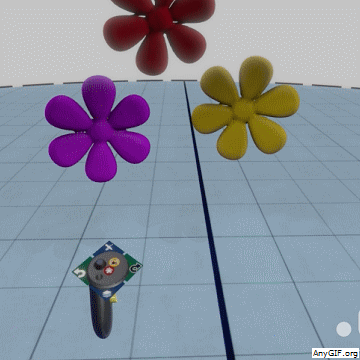
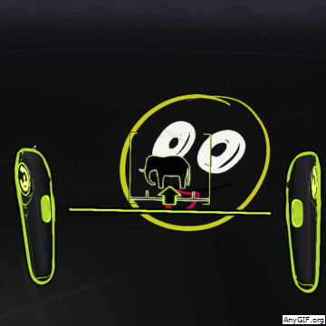

An artist uses only one hand, his dominant one, to paint. This hand always holds the tool confidently, and is always in view.

The other hand, on the other hand (not really funny, I know), does not take part in the actual painting, because the artist cannot control that non-dominant hand that well, and also because it’s almost impossible to simultaneously paint with both hands and get an accurate result. But it doesn’t mean that it has no use. Held away from view, armed with utilities, such as paint mixes, bushes, or a rag, the palette is always a glance away, and it goes hand in hand (I gotta stop this) with the dominant, tool holding hand.

Creation tools in virtual reality widely adopt this UI pattern for the same qualities it holds for the classic painter — you usually need just one hand, clear of distractions, and you have lots of other tools and options to choose from, kept in your other hand.

What Goes on Which Hand?

For the sake of simplicity, I will call the dominant hand ‘Right’ and the non-dominant hand ‘Left’, though when designing a creation tool you should also support the 10% of the population which are lefties, especially with the myth of them being more creative than others…

Well, like everything in this new industry, there’s no standard, but it usually goes like this:

* Left: Toolbo, xEnvironment options

* Right: Active tool, Tool options

The right hand is also used for operating the tool palette on the left hand.

If we compare it to good old Photoshop, the right hand is our cursor, which changes according to the active tool, but it also holds the top bar with the various tool options. The left hand, is kind of ‘everything else’.

### In Hand vs On Arm

The tool palette can sit over the user’s left arm. This frees both his hands to interact with objects.

But on creation tools, such as [Medium](https://www.oculus.com/medium/), [Tilt Brush](https://www.tiltbrush.com/) or [Quill](https://www.oculus.com/experiences/rift/1118609381580656/), the user actually holds the tool palette in his left hand. As described above, we mostly use just one hand to create. Probably the only action you need both hands for is to scale objects, so the grip buttons are usually reserved for that. What we earn by sacrificing the left hand is the ability to use the controller keys to reach functions easier. Since the tool palette holds so many functions, the user needs this accessibility.

### Previewing the active tool

Since most of the time the tool palette is away from view, it is important to indicate on the right hand what is the selected tool and its settings — mostly color and size.

TiltBrush are doing a great job, by emphasizing the selected color all over the virtual controller, showing the brush size as a circle, but most importantly — by leaving a fading trail of the selected brush as you wave your controller. This comes in very handy in an app that has tons of brushes, some are animated.

Oculus made up tool shapes for each action. Cute, though the tool shape doesn’t always illustrate what it does.

### With One Hand Tied Behind My Back

One of the main advantages of using the controller keys, is that they can be used while the tool palette is out of view! How great is that?

A good example is Undo and Redo. Both Tilt Brush and Medium use the left thumb clicks for that. Even though they are designed for different controllers (Tilt Brush for HTC Vive with a trackpad, and Medium for Oculus Rift with a thumbstick), it’s quite similar. So while you are painting or sculpting, focusing only on your right hand, when you regret your last move, you just snap left with your left thumb, without moving your eyes from your art or your brush. Similarly, [Gravity Sketch](https://www.gravitysketch.com/) lets you roll your left thumb to roll back in time.

The left controller buttons can also function as key modifiers, just like you instinctively hold the left Shift key when you drag an object in Photoshop with your right hand, without looking at it. Medium by Oculus are doing a great job with this:1 — You can configure the left hand trigger button to alternate between two tools (e.g Clay and Smooth), so you can switch between them instantly, without looking at the palette.2 — (This is my favorite shortcut:) While your layers panel is open, you can select a layer by pointing to it on the panel, but you can also do it by pointing to the object itself. So if you want to select an object, flick your left thumb down, without looking at it, and point and click the object with your right hand.

### Multiple Panels in One Hand

Since the left hand holds everything besides the active tool and its options, it’s usually necessary to divide the various tools into separate panels.

Tilt Brush and Unity EditorVR are using a rotating panel. That means that you have one panel in front of you, and you can reach other panels by rotating it with your left thumb. Twisting your hand can also let you access the adjacent panels, though not conveniently.

On Quill and [Pantheon](https://www.pantheonvr.com/) you need to use your right hand to switch between panels. This is the least convenient option, but if you don’t have any available buttons on the left hand controller — that’s could be your solution.

Medium use the thumbstick up/down to open the panels. This is very convenient, since you can get to any of the panels instantly, but it only works since they have just two panels, and could not have been achieved in HTC Vive, where there are no up/down thumb buttons (maybe gestures could work though).

**Here are some notes about few virtual reality creation tools and how they implement the tool palette:**

### Mediumby Oculus (Rift)

I’m starting with Medium because I feel they have done the best job so far, assigning actions to almost all buttons, and demonstrating the functionality on the virtual controllers.

* Two panels on the tool palette: Layers, and Tools. These panels are on only momentarily, while holding the thumbstick up/down. The same thumbstick is used for Undo (left) and Redo (right).

* As mentioned above — to “behind the back” features: secondary tool, and layer selection mode.

* Right-hand panels (tool options, color) are floating in place when opened, and disappear when the pointer leaves them. Having the color picker in the right hand, unlike in most other creation tools, actually makes sense when you look at it as a ‘tool option’. Also note how the laser pointer on these panels goes down instead of straight, since you are pointing with the same hand which opened the panel.

* To reduce the distraction and functionality in creation mode, a ‘home’ and ‘environment’ buttons are used for additional, less used actions.

### Tilt Brushby Google (Vive)

* To switch between panels, you flick right/left with your thumbpad

* When a panel has paginated options, use the thumbpad on your pointing hand to scroll through them

* Just like in Medium (well, Tilt Brush came first) — use both grips buttons to scale

### Quillby Oculus (Rift)

Quill’s tool palette feels like an old Mac interface. Gray beveled square buttons.

* Both hands on Quill are clear of distractions. The right hand shows a dot that represent the color and size of the active tool, and the left hand, the tool palette, is only represented by this tiny purple cube.

* On the tutorial you learn about the functions of some controller keys, which carry no hint as for their functionality later on. The left hand buttons are for Menu (Y) and for undo (X). The right hand buttons are for Color Picker (A) and Delete (B). Again — not intuitive.

* While most apps use a laser pointer to operate the tool palette, on Quill you need to ‘touch’ the tool palette with your right hand. That’s a bit more effort, but the upside is that you don’t need to dedicate a button for this operation (even though Quill are not using almost any button on the right hand controller, so that’s not the reason).The tool palette does open way closer than the purple dot, to make it easier to reach. The tool changes to a pointer when you get near the palette.

* Since there are no hints on the right hand, all the tool options are included in the tool palette. The only exception is the brush size, which is set by pushing the righ thumbstick up/down. Once again — you need to remember this from the tutorial, since there is no hint about this.

### EditorVRby Unity

A very ambitious project in its early days.

* The tool palette resembles the one of Tilt Brush — 4 rotating panels. Opening the palette is quite cumbersome, with now shortcut, and unlike Tilt Brush, users might want to close the palette quite often, since they might operate the various floating objects and panels with both hands.The shortcut for switching between panels is hinted well.Also worth noting that the palette can transform into a different palette. Currently that happens when selecting to add Primitives. Going back to the main palette requires to ‘reopen’ it, again with no shortcut.

* “Trow behind your back” as the gesture for deleting objects. Not related directly to the tool palette, but worth mentioning as a creative way that could minimize the feature load from the tool palette.

* The right hand is not exactly the tool options, but more like a contextual menu.The radial menu , which works well in some touch apps, is not very convenient here, since there are too many options and it’s easy to click the wrong option with the thumbstick.The choice to add undo/redo in the object contextual menu is also not clear.

### Gravity Sketch(Vive/Rift)

* The palette is hidden behind a click on the left thumbstick. That button highlighted in green is the main menu. Gravity Sketch chose to keep almost all options in the palette, and not in the right hand. Even changing the brush size requires two hands.

* Switching between panels is done by flicking the thumbstick left/right, though the design does not clearly imply that.

* The color picker did stay on the right hand — again, by clicking the thumbstick.

* A creative way to undo/redo by rotating the thumbstick.

### Pantheon(Rift)

Pantheon is a product in early beta by few students from UC Berkeley.

* The palette, similar to Quill, is made of few panels, and you need to switch between them by pointing with your right hand. Not the easiest way, but they chose to use the thumbstick for locomotion, so the choices for the panels became limited.

* One of the things this app lacks the most, is the indication of the selected tool. But as mentioned — it’s an early stage product, and by looking at the quality of the product so far, I am guessing the UX improvements will follow.