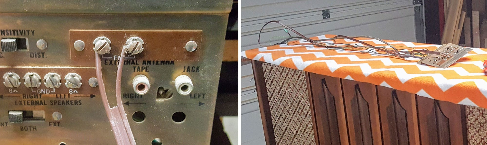
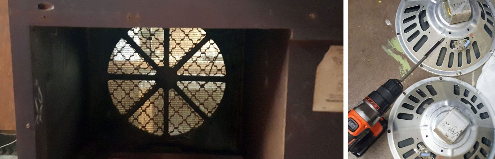
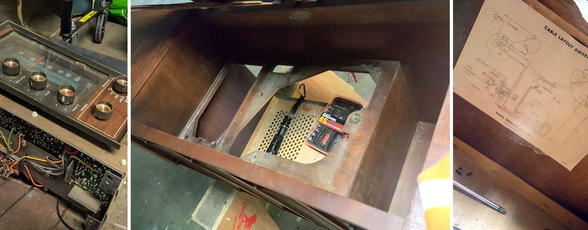
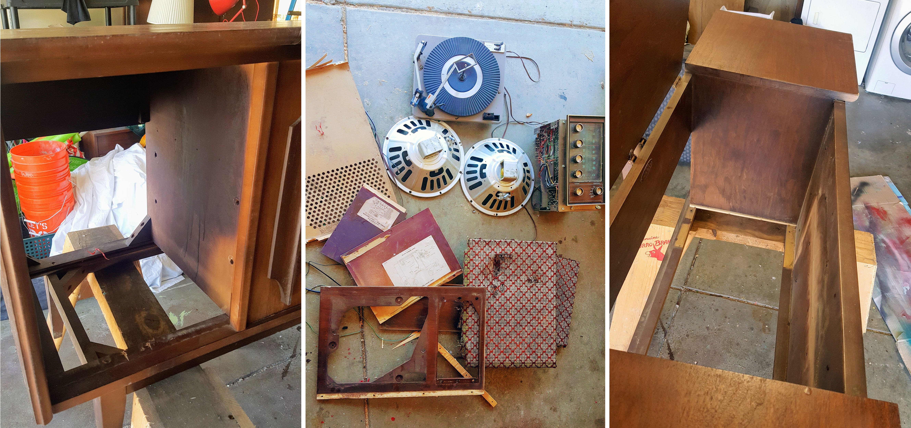
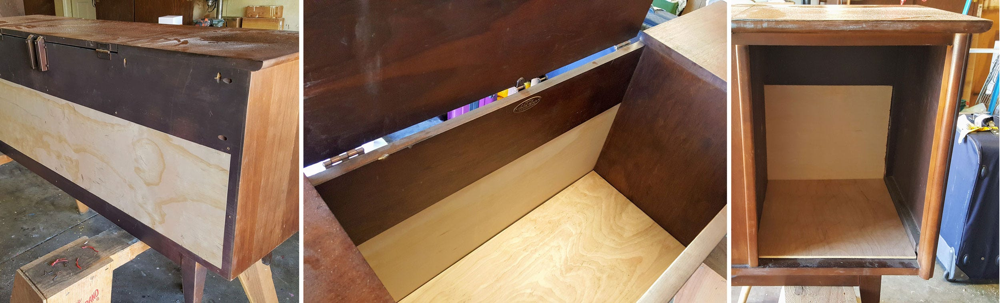
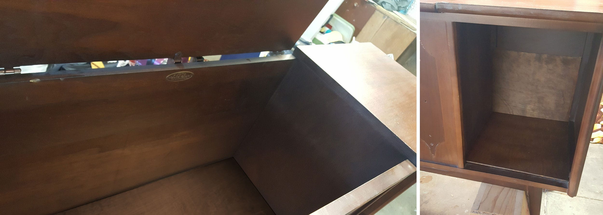
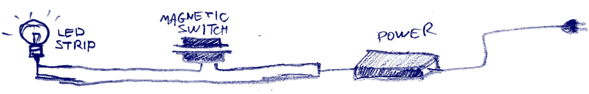
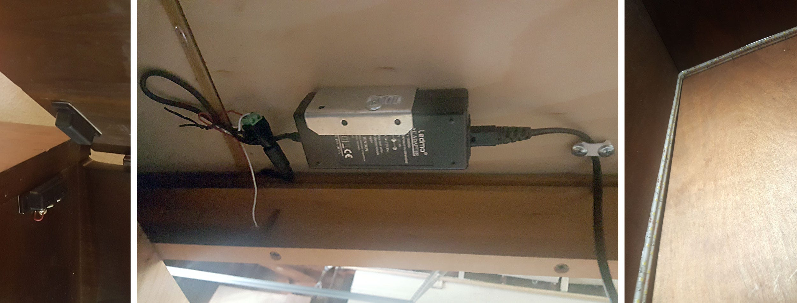
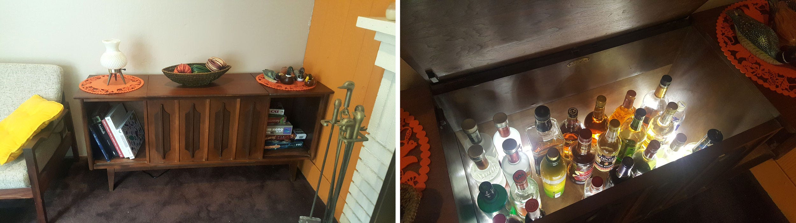

---  
id: "ecc5"  
title: "Weekend Project — From an Antique Stereo Console to a Drink Cabinet"  
slug: "weekend-project--from-an-antique-stereo-console-to-a-drink-cabinet"  
seo_title: ""  
excerpt: "Since we moved to the US, my wife fell in love in Mid-Century design. Lucky enough, this kind of furnitures is not hard to find in garage…"  
image: "1aAe9q_7ErUjCu91wqB0fkA.jpeg"  
publish_date: "2017-08-14"  
featured: true  
published: false  
  
---  

Since we moved to the US, my wife fell in love in Mid-Century design. Lucky enough, this kind of furnitures is not hard to find in garage sales around here. So, in one of her Saturday morning tours, she came home with this Silverstone stereo console:

After a short meddling, music from this old radio was filling the air, but we didn’t take it to compete with our Bose SoundTouch, but to decorate our living room. As much as we liked this antique, it was taking a lot of space for no functional reason, so I decided to turn it into a drink cabinet.

## First step — stripping the electricity off

I can’t explain why, but I put an effort in preserving all parts, and taking all the electricity apart without tearing a single cable.

Then the speakers came off. I saved the magnets — I’m sure they will come handy in a different project.

And the turntable, and the radio…

And last for this step — the speaker meshes and the turntable box. I made sure to break as little parts as possible, because I didn’t wand to damage a piece I might need later. It felt like solving a puzzle, finding which part should come out next. Where wood pieces were glued together it was tricky, but a hammer and a flat screwdriver did the trick.

By the end of this step, I was left with a naked cabinet and a pile of cool looking retro garbage.

## Step 2 — Build the missing parts

Enough with removing. Now it’s time to add. Actually, the only thing I still needed to remove were few corner supporters, which you can see on the last photo on the left. I had to use a manual saw on this one.

So the parts are:

* 3/4" plywood to close the back.
* 3/4" plywood as a floor for the central cabinet
* 1/8" plywood as a floor for the speaker spaces, which will become open shelves.

There was no need to build support for the floors, since the cabinet already has supporting beams. Lucky me.

Once I saw all pieces fit, I took them apart and stained them. Here’s how it looks. Note that the back wall of the center cabinet is made of two parts — the original at the top, an my stained addition at the bottom. With a correct selection of stain, you can barely tell the difference.

## Step 3 — Lights!

So the structure is ready, and I wanted to add automatic lights that turn on when I open the cabinet.

The idea is simple: A power adaptor ([$9](https://www.amazon.com/gp/product/B01NAPCAOM/ref=oh_aui_detailpage_o03_s00?ie=UTF8&psc=1)) outputs 12V, which is connected to a LED strip ([$9](https://www.amazon.com/gp/product/B01K6MQNHU/ref=oh_aui_detailpage_o03_s00?ie=UTF8&psc=1)). Along the wire, you add a magnetic switch ([$7](https://www.amazon.com/gp/product/B0009SUF08/ref=oh_aui_detailpage_o09_s00?ie=UTF8&psc=1)), which disconnects when the door is closed, and the two pieces are in close proximity.

Cutting and connecting wires is ugly, and there are parts that let you run this the OCD way, but they are pricier. I just made sure that you can’t see any wire.

## Behold!

We now have a cabinet for all those bottles we never drink from!

