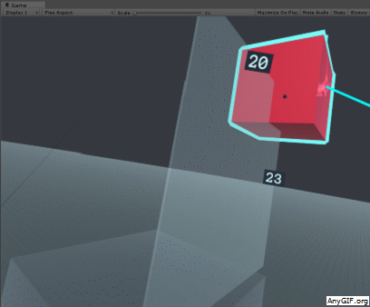
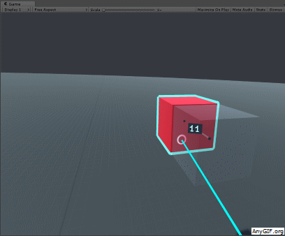
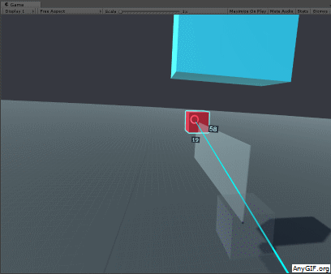
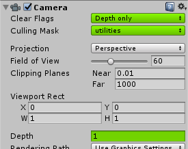

I am working on an [experiment around accurate transformation of objects](/experiment-accurate-modelling-in-vr-b16cb0395e2b), and part of the accuracy is done by showing the measurements of the transformation.

Measurement labels have their unique requirements, since they don’t have a fixed position in space, and the following tips are mostly relevant for such case.

## 1 — Set the labels to face the camera

If you are not sure where the viewer will be when looking at the label, it’s a good practice to set the label to face the viewer’s position.



It’s fairly easy in Unity:

```
textLabel.transform.LookAt(GameObject.FindWithTag("Player"));
```

## 2 — Resize the font size according to distance

Makes sense, right? If a text label is close — the font size can be small, but if the user might be far away from the label — you’ll need to scale it up if you want to keep it legible.



This can also be done easily in Unity. The parameters in the ‘labelScale’ variable definition are the ones I used in the demo above, making all labels look the same size regardless of their distance, but choose any numbers that work for you.

```
float labelScale = 0.3f + Vector3.Distance(transform.position, World.viewerPosition) * 0.3f;textLabel.transform.localScale = new Vector3(labelScale, labelScale, labelScale);
```

## 3 — Render the labels on a different camera

If there’s a chance that the text labels might be hidden by other objects, and it’s important to your application that the user keeps seeing the labels at all times, you can render the text labels on top of the rest. It’s usually a weird thing to do, that breaks immersion a bit, so I would only use it when it’s important.



To achieve this:- Put the labels on a dedicated layer (e.g ‘utilities’)- Add a new camera- Set the camera’s Culling Mask to that layer- Set the camera’s Clear Flags to ‘Depth Only’- Set the camera’s Depth to 1 (assuming the original camera is 0).



Source: [VR UX Design](http://vrux.design/text-labels-in-vr/)