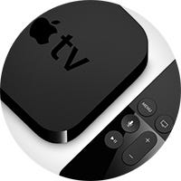
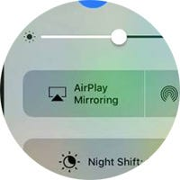

I am not the guy who tries predicting the future just to say “I told you so”, but the idea of Apple selling their own TV sets strikes me as a logical move in many ways, that I can’t understand how come it’s not happening.

### First, What’s wrong with the external Apple TV?

I owned Apple TV since it’s first generation. I understand why Apple chose to create a cheap device that connects to any TV instead of selling the TV itself, but I believe that **external devices just don’t work**. There are two reasons why:

1 — When most people consume TV content through a cable provider, that’s their default. When they want to watch something — they just turn the TV on, and zap through channels.

2 — Nobody loves a second remote. The first one is already one too many, with its gazillion buttons that nobody uses, but you have no choice but to use it. Once in a while, when you want to use that secondary one, you need to go through the ceremony of looking through the drawers and under the sofa cushions. Especially if it’s the Apple TV remote, that recently changed from ‘tiny’ to ‘very small’.

3 — Buying an external device is a separate decision than buying a TV. So the consumer needs to decide that he wants to invest in it. If Apple were to sell TV sets, that would just be another (probably lucrative) option to choose from. Many would even choose Apple without understanding why it’s better for them.

4 — Cables and dongles. Need I say more?

### The obvious home assistant

Having an Apple TV set in the living room could be Apple’s response to Alexa or Google Home. Hopefully, Siri would know to do more than to offer web pages soon. Having a home assistant on your TV makes total sense, since you get a visual feedback, plus you get a good quality audio (maybe the TV is even connected to an external sound system). It’s true that the TV is not always on, but I bet apple can find a way to turn part of the screen on when needed.

### It’s in Apple’s nature

Apple have a long track record of manufacturing good quality screens. They have the expertise, the relationships and the assembly lines to build great quality TVs for the 8K generation.

Apple are also great at creating an ecosystem. There is no need to elaborate on the potential of connecting your other Apple devices to your TV, since it’s already happening with Apple TV. Now imagine that on a platform that actually works. Imagine that even while you’re watching your cable TV, or Netflix, the TV can respond to your iPhone…

Apple’s brand is strong enough to achieve margins bigger than others. If Apple knows how to sell watches for $300-$3,000, they can make bigger profits on TVs.

### A fight against Samsung

It’s no secret that Samsung are Apple’s [biggest rival](https://9to5mac.com/2017/02/01/apple-samsung-smartphone-share-iphone-idc/) in smart phones, but Samsung are also known for their dominance in the TV market. In October 2015, Samsung [reported](https://www.theverge.com/2015/11/19/9760162/samsung-tv-sales-record-north-america) a market share of 35% in the US.

The margins on TVs are not that high, and selling TVs might increase Apple’s revenue by just a few percents, but it’s the ecosystem power that Apple will earn from. I have a feeling that they can do a much better job than what Samsung did so far.