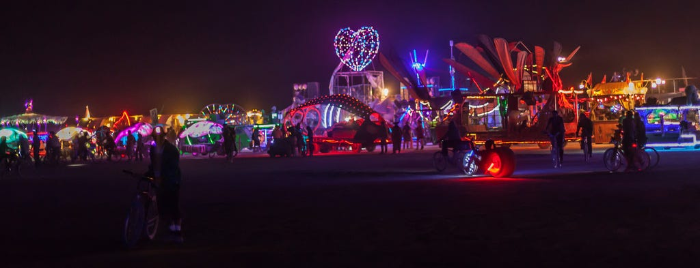
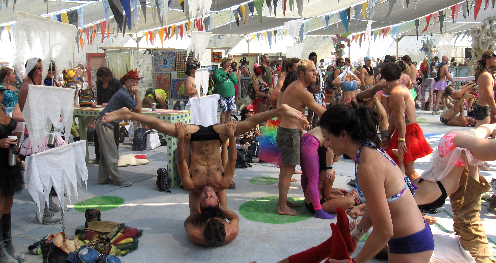
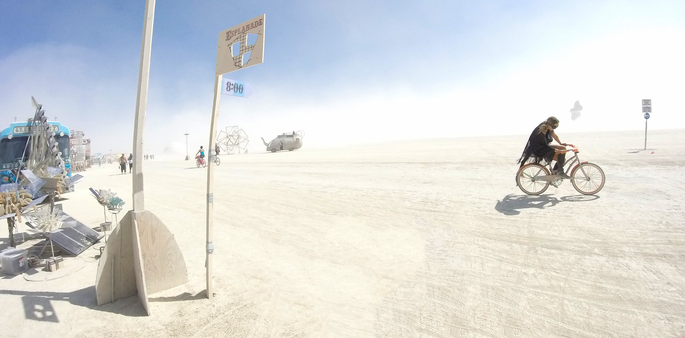
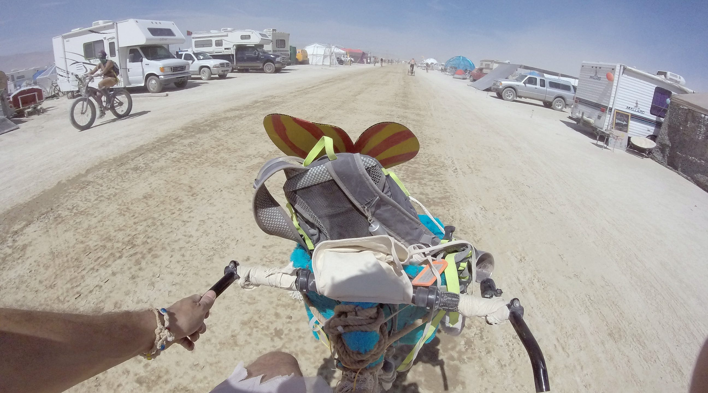

Surviving this amazing social event as an introvert

I just returned from my first Burning Man. Mentally, I’m not back yet — it’s a process. Most people, when returning from BM, talk about the amazing experience. Well — it IS amazing in so many ways. For me, riding my bike in the Playa at night, between art cars, lights, fire and dance clubs, is an experience that takes my breath away whenever I think of it. And the sunrise…. oh, it all feels like a dream.

But there’s another emotion that filled me, especially during the days, which not many people talk about. **I was lonely**.

It’s important to understand the difference between ALONE and LONELY. I went with friends, so I didn’t have to be alone. I am also an introvert ([are you?](http://www.quietrev.com/the-introvert-test/)), so being alone is kind of my thing. When I knew I was going to BM, I thought that being alone was the right way to experience it. You can go do whatever you want and be whoever you want. You can get lost (in a good way) without caring for anyone else. It’s only you and your desires. Many others think the same way — most of them find out how hard it is.

Burning Man is all about going places. Especially during the days. You pack your gear, hop on your bike, and ride the streets until you see a camp that attracts you. It can be a bar, a yoga class, a steam bath, a spiritual chill place, or a couples exchange tent. There are hundreds of camps, and you get to choose. It’s all free, and everyone is welcome.

**Once you are inside a camp — you are surrounded by people, and expected to interact — talk, share, hug and gift. One of the principals of BM is “No Spectators”, which means that the audience is part of the activity.**

If you’re an introvert like me, when you go into a camp full of strangers — you need your quiet space alone. That’s where it gets lonely; while it seems like everyone are with friends and meeting new ones, you are a silent observer. You might notice another silent, lonely observer, and he/she might be looking right back at you, but neither of you will start a conversation. Not a long one, at least. You can’t avoid the crowd around you — they are everywhere, having fun, and you have no smartphone to escape to.

Eventually, you end up not wanting to go places, because you hate that loneliness. You go by them, take a look inside, telling yourself “Go in! What’s stopping you?”. **You just want to be alone so you won’t feel lonely**. So you get out to the endless playa, or worse — you go back to your camp and waste your day.

This is harsh. Believe me. Burning Man is a place for emotions. It’s a place so different than the real world, that it destabilizes you in less than a day. And in that turbulence, emotions rarely stay buried in your guts — they float up to your throat and choke you.

At first you fight it. You beat yourself for your inability to interact. But if you’re smart enough (I wasn’t), you realize that**that’s who you are**. It will not solve your loneliness, and you will still want to be alone and waste your time there, but you will not hate yourself too much.

So — how do you solve this?It took me two days to understand that **I want to be alone with someone**. It sounds funny, I know, and it ruins the ability to be totally free, but as a couple or a group you will find a grater confidence to go places, and even the courage to interact with strangers. You can still have your alone moments, but avoid being alone too much. Not in Burning Man.If you do have someone you know in your camp, my best advice is to share your feelings with them. A simple hug and a kind word will help you realize that you are not a freak. And the funny thing is that you will find out that every second person in Burning Man feels the same way as you do. So find one and be alone together. Unfortunately, it took me too long to express my feelings. That was my #1 lesson from this amazing place.

If you have any thoughts or experienced a similar feeling — please be a good friend and share.

